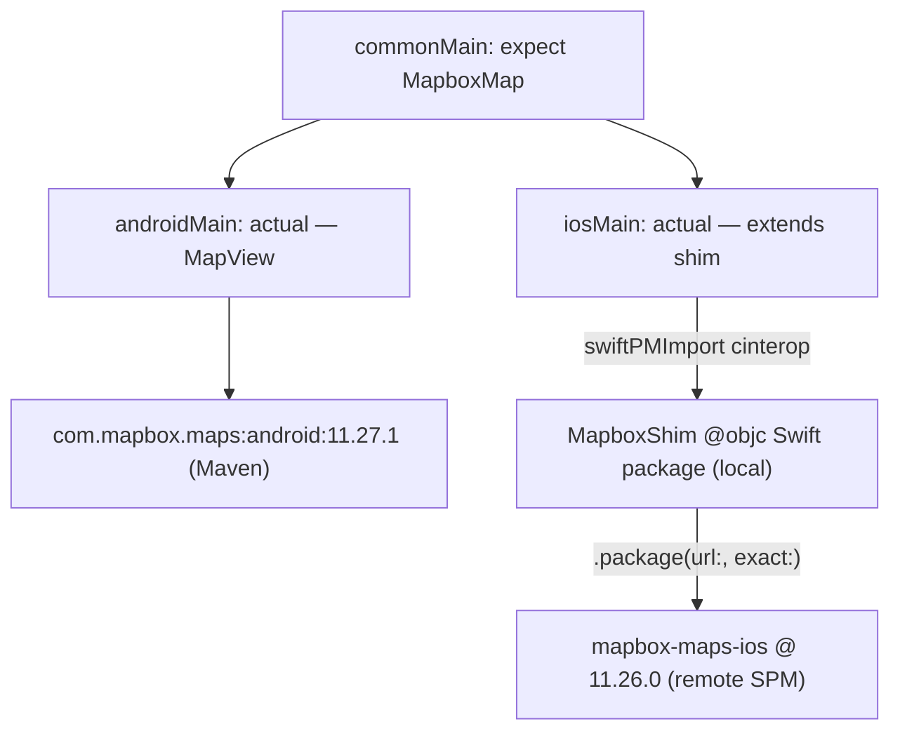

# mapbox-maps-kmp

A thin Kotlin Multiplatform facade over the two native Mapbox SDKs, using Kotlin 2.4's `swiftPMDependencies` to solve the pure-Swift interop problem that blocked everyone in [mapbox/mapbox-maps-android#2281](https://github.com/mapbox/mapbox-maps-android/issues/2281).

## The problem this solves

`MapboxMaps` (iOS) is pure Swift, and Kotlin/Native cinterop can only bind to Objective-C. Every workaround in that issue thread converges on the same wall: raw cinterop over the `.xcframework`s gets you `MapView`, but not `mapView.mapboxMap` or anything else with a Swift-only shape (structs, protocols, generics). Some gave up on Kotlin-side interop entirely and injected a `UIViewController` from the Xcode project instead.

The fix here isn't finding an ObjC face on Mapbox's Swift API — there isn't one. It's writing one: a small `@objc` Swift class wraps `MapView`, and Kotlin binds to *that*. Mapbox's SDKs stay completely untouched.



## Version matrix

- Kotlin `2.4.10`, Gradle `9.6.1`, AGP `9.2.1`, Compose Multiplatform `1.11.1`
- Mapbox Android `11.27.1`, Mapbox iOS `11.26.0` (not released in lockstep; nearest pair)
- iOS deployment target `14.0`, matching `MapboxMaps`' `platforms: [.iOS(.v14)]`

## Repo layout

```
mapbox-maps-kmp/
├── Package.swift               # repo is also a consumable Swift package (see below)
├── settings.gradle.kts, build.gradle.kts, gradle/libs.versions.toml
├── mapbox/                      # the KMP library
│   ├── build.gradle.kts
│   ├── native/Package.swift     # local SPM package, consumed via swiftPMDependencies;
│   │                            #   itself depends on mapbox-maps-ios @ 11.26.0 (remote)
│   ├── native/MapboxShim/*.swift
│   └── src/{commonMain,androidMain,iosMain}/kotlin
└── demo/                        # Compose Multiplatform demo app
    ├── shared/                  # shared composable (DemoScreen, MapboxMapView expect/actual)
    ├── androidApp/               # Android application module
    └── iosApp/                   # Xcode project (checked in — see below)
```

## v0 API surface

```kotlin
// commonMain
data class CameraPosition(
    val latitude: Double, val longitude: Double,
    val zoom: Double = 12.0, val bearing: Double = 0.0, val pitch: Double = 0.0,
)

expect class MapboxMap() {
    fun setStyleUri(uri: String)
    fun setCamera(camera: CameraPosition, animated: Boolean = false)
    fun onStyleLoaded(callback: () -> Unit)
}
```

`androidMain` wraps `com.mapbox.maps.MapView` and exposes it as `MapboxMap.view` for embedding via `AndroidView`. `iosMain` subclasses the Swift shim directly, so a `MapboxMap` instance *is* a `UIViewController` you can embed via Compose Multiplatform's `UIKitViewController`:

```kotlin
actual class MapboxMap actual constructor() : MapboxMapController()
```

## Credentials

Two separate tokens are involved, and they have very different requirements.

### The runtime `pk.*` public token — required

Nothing renders without it. Get one from your [Mapbox account](https://console.mapbox.com/account/access-tokens/). It never lives in a tracked file:

- **Android**: set `MAPBOX_PUBLIC_TOKEN` in your user-level `~/.gradle/gradle.properties` (or the `MAPBOX_PUBLIC_TOKEN` env var). It's read into a manifest placeholder at build time and applied via `MapboxOptions.accessToken` in `DemoApplication.onCreate()`. Missing or placeholder values fail loudly at startup rather than shipping a blank map.
- **iOS**: copy `demo/iosApp/Config/Local.xcconfig.example` to `demo/iosApp/Config/Local.xcconfig` (gitignored) and fill in `MAPBOX_PUBLIC_TOKEN`. It flows into `Info.plist`'s `MBXAccessToken` key, which `MapboxMaps` reads automatically.

### The `DOWNLOADS:READ` secret token — optional, but wired

Mapbox's docs say this is mandatory for downloading the SDKs themselves. Tested against the live registry with no credentials configured, that's **no longer true for either platform**: `swift package resolve` against `mapbox-maps-ios` completed fully unauthenticated (including the `MapboxCommon`/`MapboxCoreMaps` binary targets from `api.mapbox.com`), and the Android `.aar` artifacts download fine anonymously too.

One sharp edge shaped the design: sending a **wrong** token returns `401`, while sending **none** returns `200`. So a naive `credentials {}` block that forwards an unset property as an empty password would be strictly worse than omitting credentials entirely — `settings.gradle.kts` only attaches `credentials {}` when `MAPBOX_DOWNLOADS_TOKEN` is present and non-blank.

Still, the token is wired as optional-but-supported rather than ignored: the docs may reflect intent that gets re-enforced, and private/snapshot channels do require it.

- **Android**: set `MAPBOX_DOWNLOADS_TOKEN` in `~/.gradle/gradle.properties` or the env var of the same name, if you ever need it.
- **iOS**: SwiftPM reads `~/.netrc` for `api.mapbox.com` on its own; Kotlin's `swiftPMDependencies` shells out to SwiftPM, so it inherits this for free. Nothing to configure unless you hit a 401.

Either way: `.gitignore` covers `local.properties`, `*.xcconfig` (except `*.xcconfig.example`), and `.netrc`. No secret ever touches a tracked file, and the Gradle build works fully anonymously today.

## Versioned dependencies, not submodules

Both platforms pin to a released version rather than vendoring source in the repo:

- **iOS**: `mapbox/native/Package.swift` depends on `mapbox-maps-ios` via a plain remote SwiftPM package pin:

  ```swift
  .package(url: "https://github.com/mapbox/mapbox-maps-ios.git", exact: "11.26.0")
  ```

  `exact:`, not `from:` — the point is a single, deliberately-bumped pin (reviewable as a one-line `git diff`), not a floating semver range that could silently resolve to a newer tag on a clean checkout. This still has to target a tagged release rather than `main`: `Package.swift` on `mapbox-maps-ios`'s `main` branch pins SNAPSHOT builds of `MapboxCommon`/`MapboxCoreMaps`, while tagged releases (like `v11.26.0`) pin real ones. Verified end to end — `swift package resolve` against this exact manifest resolves `mapbox-maps-ios` to revision `b5322aad...` (the same commit `v11.26.0` names) with real, non-SNAPSHOT `MapboxCommon`/`MapboxCoreMaps` binary artifacts. The resulting pin is what ends up in `.swiftpm-locks/default/swiftImport/Package.resolved`, which is tracked in git for reproducible resolution (see `.gitignore`'s comment on it); the SwiftPM checkout/artifact cache alongside it under `.swiftpm-locks/*/swiftPMCheckout/` is not — that's hundreds of MB of re-fetchable source and binaries, explicitly gitignored.
- **Android**: unchanged by any of this — `api("com.mapbox.maps:android:11.27.1")` from Mapbox's Maven repo, as it always was.

### The submodule alternative — considered, not taken

An earlier version of this repo vendored `mapbox-maps-ios` (and, reference-only, `mapbox-maps-android`) as git submodules instead of the versioned dependencies above. The argument for that approach is worth keeping on record, because it's really an argument about *agent* context, not the build:

The hard part of this repo isn't writing Kotlin, it's knowing the native API surface — which Swift symbols exist at a given version, and which are generic- or protocol-typed and therefore can't cross into `@objc` at all (Kotlin/Native cinterop only binds Objective-C). With a submodule, answering that is `rg` against local source at the *exact pinned version* — including for an AI coding agent working in this repo, which can grep a checked-out submodule the same way a human would, with no network round-trip and no guessing at API shape from documentation that lags releases. That's exactly the trap that cost people weeks of dead-end debugging in the linked issue. A plain versioned dependency gives up that local grep-ability: reading the actual source now means a separate temporary clone (e.g. `git clone --branch v11.26.0 https://github.com/mapbox/mapbox-maps-ios`) or digging through SwiftPM's package cache, rather than a folder already sitting in the working tree.

We moved off submodules anyway. A few hundred MB of clone and submodule pointers that need bumping deliberately is an ongoing cost for a benefit — local source browsing — that's occasional rather than constant, and it never even applied to Android in a build sense (see below). If this repo's day-to-day work goes back to being mostly "reverse-engineer an undocumented Swift API," reintroducing the iOS submodule is a one-line, fully reversible change — swap the `.package(url:, exact:)` line in `mapbox/native/Package.swift` back to `.package(path: "../../submodules/mapbox-maps-ios")` and re-add the submodule.

## Why we don't vendor mapbox-maps-android at all

Building it from source (a Gradle composite build) isn't viable and wouldn't have reached the part that matters even with a submodule in place:

- **Version gap.** Its `:maps-sdk` module pins Kotlin `1.7.20` and AGP `8.10.1` (via its own `com.mapbox.gradle.library` convention plugin, which applies the classic `com.android.library`, not the AGP 9 KMP-native plugin this repo uses), against this repo's Kotlin `2.4.10` / AGP `9.2.1`. Linking it in would mean a Gradle composite build — `includeBuild("mapbox-maps-android") { dependencySubstitution { substitute(module("com.mapbox.maps:android")).using(project(":maps-sdk")) } }` — and a composite build runs every included build under one Gradle version, whichever invoked the outer build. That means its Kotlin Gradle Plugin 1.7.20 would have to load on whatever recent Gradle version AGP 9.2.1 needs, and KGP 1.7.20 predates several Gradle API removals since — a real risk of a hard failure, "fixable" only by patching its version catalog, which turns a clean pinned checkout into a fork.
- **It doesn't reach the part that matters.** `:maps-sdk`'s dependency graph bottoms out at `:sdk-base`, whose `glNative { configuration = "api" }` pulls `com.mapbox.maps:android-core:11.27.1` — a prebuilt AAR containing the closed-source C++ rendering engine — from Maven regardless. Mapbox doesn't publish that engine's source at all, so "building from source" would only ever reach the thin Kotlin wrapper/plugin layer (`:maps-sdk`, `:sdk-base`, `:plugin-*`, `:extension-*`), not remove any actual binary dependency.

So: `api("com.mapbox.maps:android:11.27.1")`, full stop. If you need to read the Android SDK's source, a temporary `git clone --branch v11.27.1 https://github.com/mapbox/mapbox-maps-android` works the same way the iOS one does above.

## Integrating into your own app

`:mapbox` isn't published anywhere yet, but two paths get it into a separate app, with different trade-offs.

### Option A: publish to mavenLocal

`mapbox/build.gradle.kts` applies `maven-publish` with `group = "dev.mapboxkmp"` and `version = "0.1.0-SNAPSHOT"`. From this repo:

```bash
./gradlew :mapbox:publishToMavenLocal
```

This produces the root `dev.mapboxkmp:mapbox:0.1.0-SNAPSHOT` metadata artifact plus per-target variants (`mapbox-android`, `mapbox-iosarm64`, `mapbox-iossimulatorarm64`) under `~/.m2/repository`; Gradle picks the right one per target automatically. In the consumer app, add `mavenLocal()` to `settings.gradle.kts`'s `dependencyResolutionManagement.repositories`, then depend on it from a shared/commonMain source set:

```kotlin
implementation("dev.mapboxkmp:mapbox:0.1.0-SNAPSHOT")
```

**Android just works** — `:mapbox` depends on the Mapbox Android SDK via `api`, so it's transitively on the consumer's classpath too.

**iOS is subtler, and worth understanding rather than assuming.** Kotlin's `swiftPMDependencies` is designed to propagate transitively through a published klib — verified here by adding a throwaway consumer module that depended on the mavenLocal artifact *without declaring `swiftPMDependencies` itself*: Gradle still registered `embedAndSignAppleFrameworkForXcode`/`integrateLinkagePackage` for it and picked up `MapboxShim` automatically, with no extra configuration. So the propagation mechanism genuinely works. But the metadata baked into the published artifact records *how `:mapbox` itself declared the `MapboxShim` dependency* — via `localSwiftPackage(directory = layout.projectDirectory.dir("native"), ...)`, i.e. a local filesystem path. Inspecting that serialized metadata directly shows it: the dependency is recorded with the publishing machine's absolute path to `mapbox/native` baked in verbatim. That path only resolves on a machine where this repo happens to be checked out at that exact location — not true for an arbitrary consumer, so on any other machine the transitive linkage silently has nothing valid to resolve.

This is a different local-vs-remote question than "Versioned dependencies, not submodules" above — that one was about `MapboxShim`'s *own* dependency on `mapbox-maps-ios`, internal to `mapbox/native/Package.swift` and invisible to Kotlin/Gradle. This one is about how `mapbox/build.gradle.kts` declares *its* dependency on the `MapboxShim` package. Making that portable means hosting `MapboxShim` as its own versioned, tagged package (its own repo) and switching to the DSL's remote form:

```kotlin
swiftPMDependencies {
    swiftPackage(
        url = url("https://github.com/<you>/mapbox-shim.git"),
        version = from("0.1.0"),
        products = listOf(product("MapboxShim")),
    )
}
```

That's a real restructuring (splitting the shim into its own repo), not a config tweak — so today, treat mavenLocal as Android-ready and iOS-workable-only-on-the-publishing-machine.

### Option B: git submodule + Gradle composite build

Add this repo as a submodule of the consumer, then wire it in with `includeBuild` + dependency substitution — the same recipe discussed (and rejected, for different reasons) for `mapbox-maps-android` above:

```kotlin
// consumer's settings.gradle.kts
includeBuild("submodules/mapbox-maps-kmp") {
    dependencySubstitution {
        substitute(module("dev.mapboxkmp:mapbox")).using(project(":mapbox"))
    }
}
```

Unlike `mapbox-maps-android`, there's no version-gap problem here — this repo already targets a current Kotlin (`2.4.10`) and AGP (`9.2.1`), so a consumer on a comparably current toolchain should compose cleanly under one Gradle version. Also unlike the earlier version of this repo, there's no *nested* submodule to worry about either — this repo no longer vendors `mapbox-maps-ios` as a submodule itself (see "Versioned dependencies, not submodules" above), so a plain `git submodule update --init` at the consumer's top level is all that's needed; SwiftPM resolves `mapbox-maps-ios` remotely regardless of how this repo itself was obtained.

One thing doesn't go away with a composite build: **iOS linkage still has to happen at the consumer's own app module.** `swiftPMDependencies`'s linkage package is generated relative to whichever Gradle module produces the final iOS framework, so the consumer's iOS-facing module still needs to run the same `embedAndSignAppleFrameworkForXcode` / `integrateLinkagePackage` steps documented below for `demo/iosApp`, against their own Xcode project. What a composite build *does* solve over Option A is the portability problem — Gradle resolves `mapbox/native` from the actual submodule checkout on the consumer's own disk, not from baked-in publish-time metadata.

Given everything here is still a thin, fast-moving facade over two native SDKs under active development, a submodule is a reasonable choice for a downstream app that wants to track this repo closely — at least until `MapboxShim` is split out as its own hosted package and this module gets a real release process.
