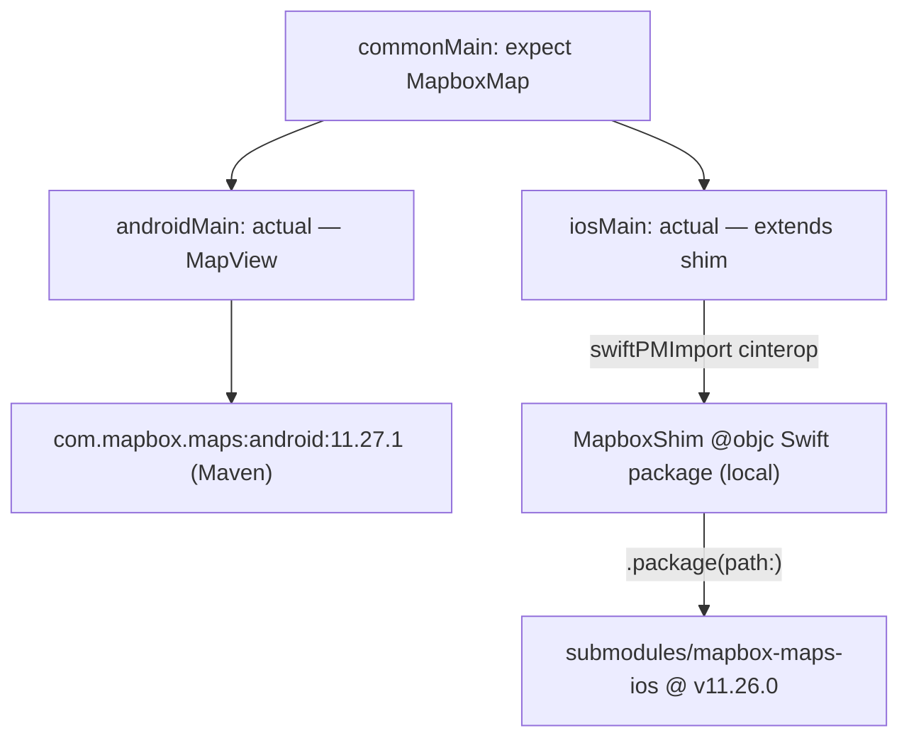

# mapbox-maps-kmp

A thin Kotlin Multiplatform facade over the two native Mapbox SDKs, using Kotlin 2.4's `swiftPMDependencies` to solve the pure-Swift interop problem that blocked everyone in [mapbox/mapbox-maps-android#2281](https://github.com/mapbox/mapbox-maps-android/issues/2281).

## The problem this solves

`MapboxMaps` (iOS) is pure Swift, and Kotlin/Native cinterop can only bind to Objective-C. Every workaround in that issue thread converges on the same wall: raw cinterop over the `.xcframework`s gets you `MapView`, but not `mapView.mapboxMap` or anything else with a Swift-only shape (structs, protocols, generics). Some gave up on Kotlin-side interop entirely and injected a `UIViewController` from the Xcode project instead.

The fix here isn't finding an ObjC face on Mapbox's Swift API — there isn't one. It's writing one: a small `@objc` Swift class wraps `MapView`, and Kotlin binds to *that*. Mapbox's SDKs stay completely untouched.



## Version matrix

- Kotlin `2.4.10`, Gradle `9.6.1`, AGP `9.2.1`, Compose Multiplatform `1.11.1`
- Mapbox Android `11.27.1`, Mapbox iOS `11.26.0` (not released in lockstep; nearest pair)
- iOS deployment target `14.0`, matching `MapboxMaps`' `platforms: [.iOS(.v14)]`

## Repo layout

```
mapbox-maps-kmp/
├── Package.swift               # repo is also a consumable Swift package (see below)
├── settings.gradle.kts, build.gradle.kts, gradle/libs.versions.toml
├── submodules/
│   ├── mapbox-maps-ios/         # @ v11.26.0  (in the build — see mapbox/native/Package.swift)
│   └── mapbox-maps-android/     # @ v11.27.1  (reference only; the release .aar is used instead)
├── mapbox/                      # the KMP library
│   ├── build.gradle.kts
│   ├── native/Package.swift     # local SPM package, consumed via swiftPMDependencies
│   ├── native/MapboxShim/*.swift
│   └── src/{commonMain,androidMain,iosMain}/kotlin
└── demo/                        # Compose Multiplatform demo app
    ├── shared/                  # shared composable (DemoScreen, MapboxMapView expect/actual)
    ├── androidApp/               # Android application module
    └── iosApp/                   # Xcode project (generated via xcodegen — see below)
```

## v0 API surface

```kotlin
// commonMain
data class CameraPosition(
    val latitude: Double, val longitude: Double,
    val zoom: Double = 12.0, val bearing: Double = 0.0, val pitch: Double = 0.0,
)

expect class MapboxMap() {
    fun setStyleUri(uri: String)
    fun setCamera(camera: CameraPosition, animated: Boolean = false)
    fun onStyleLoaded(callback: () -> Unit)
}
```

`androidMain` wraps `com.mapbox.maps.MapView` and exposes it as `MapboxMap.view` for embedding via `AndroidView`. `iosMain` subclasses the Swift shim directly, so a `MapboxMap` instance *is* a `UIViewController` you can embed via Compose Multiplatform's `UIKitViewController`:

```kotlin
actual class MapboxMap actual constructor() : MapboxMapController()
```

## Credentials

Two separate tokens are involved, and they have very different requirements.

### The runtime `pk.*` public token — required

Nothing renders without it. Get one from your [Mapbox account](https://console.mapbox.com/account/access-tokens/). It never lives in a tracked file:

- **Android**: set `MAPBOX_PUBLIC_TOKEN` in your user-level `~/.gradle/gradle.properties` (or the `MAPBOX_PUBLIC_TOKEN` env var). It's read into a manifest placeholder at build time and applied via `MapboxOptions.accessToken` in `DemoApplication.onCreate()`. Missing or placeholder values fail loudly at startup rather than shipping a blank map.
- **iOS**: copy `demo/iosApp/Config/Local.xcconfig.example` to `demo/iosApp/Config/Local.xcconfig` (gitignored) and fill in `MAPBOX_PUBLIC_TOKEN`. It flows into `Info.plist`'s `MBXAccessToken` key, which `MapboxMaps` reads automatically.

### The `DOWNLOADS:READ` secret token — optional, but wired

Mapbox's docs say this is mandatory for downloading the SDKs themselves. Tested against the live registry with no credentials configured, that's **no longer true for either platform**: `swift package resolve` against `mapbox-maps-ios` completed fully unauthenticated (including the `MapboxCommon`/`MapboxCoreMaps` binary targets from `api.mapbox.com`), and the Android `.aar` artifacts download fine anonymously too.

One sharp edge shaped the design: sending a **wrong** token returns `401`, while sending **none** returns `200`. So a naive `credentials {}` block that forwards an unset property as an empty password would be strictly worse than omitting credentials entirely — `settings.gradle.kts` only attaches `credentials {}` when `MAPBOX_DOWNLOADS_TOKEN` is present and non-blank.

Still, the token is wired as optional-but-supported rather than ignored: the docs may reflect intent that gets re-enforced, and private/snapshot channels do require it.

- **Android**: set `MAPBOX_DOWNLOADS_TOKEN` in `~/.gradle/gradle.properties` or the env var of the same name, if you ever need it.
- **iOS**: SwiftPM reads `~/.netrc` for `api.mapbox.com` on its own; Kotlin's `swiftPMDependencies` shells out to SwiftPM, so it inherits this for free. Nothing to configure unless you hit a 401.

Either way: `.gitignore` covers `local.properties`, `*.xcconfig` (except `*.xcconfig.example`), and `.netrc`. No secret ever touches a tracked file, and the Gradle build works fully anonymously today.

## Submodules vs. versioning

Split by platform rather than answered once:

- **iOS: submodule, in the build.** `mapbox/native/Package.swift` depends on `submodules/mapbox-maps-ios` via `.package(path:)`, which resolves to whatever commit the submodule is checked out at — a stricter pin than a semver range. This also dodges a real trap: `Package.swift` on `mapbox-maps-ios`'s `main` branch pins SNAPSHOT builds of `MapboxCommon`/`MapboxCoreMaps`, while tagged releases (like `v11.26.0`) pin real ones — so pinning to a tag is mandatory either way, and a submodule makes that pin explicit and reviewable in `git diff`. SwiftPM runs `git submodule update --init --recursive` on checkout, so consumers of the published root `Package.swift` still resolve the tree correctly.
- **Android: submodule, out of the build.** Reference source only — see below for why.

**The versioned alternative, for iOS.** `mapbox/native/Package.swift`'s single `.package(path:)` line is the only thing that would need to change to drop the submodule and depend on a released tag remotely instead:

```swift
.package(url: "https://github.com/mapbox/mapbox-maps-ios.git", from: "11.26.0")
```

Both forms give the same strictness — a submodule pointer and a semver `from:` constraint are each pinned to one resolvable commit once `Package.resolved` is generated, and both must target a tag rather than `main` to avoid the SNAPSHOT-binary trap above. The difference is purely local availability of source: a submodule gives you `rg`-able source at that exact version on disk (the agentic argument above); a remote package gives you a smaller `git clone` and no submodule bookkeeping, at the cost of needing to re-clone or dig through SwiftPM's package cache any time you need to read the API you're binding to. This repo picked the submodule; swapping the one line above is all it'd take to go the other way.

**The agentic argument**, worth stating plainly: the hard part here isn't writing Kotlin, it's knowing the native API surface — which Swift symbols exist at a given version, and which are generic- or protocol-typed and therefore can't cross into `@objc` at all (Kotlin/Native cinterop only binds Objective-C). With a submodule, that question is `rg` against local source at the *exact pinned version*. With a versioned binary dependency, there's nothing to read locally, and documentation lags releases — which is exactly the trap that cost people weeks of dead-end debugging in the linked issue. The cost is honest: a few hundred MB of clone, and submodule pointers that must be bumped deliberately. Worth it for a repo whose entire job is mirroring someone else's API.

**Why Android's submodule stays out of the build**: linking it would mean a Gradle composite build — `includeBuild("submodules/mapbox-maps-android") { dependencySubstitution { substitute(module("com.mapbox.maps:android")).using(project(":maps-sdk")) } }` — plus its nested `pluginManagement { includeBuild("mapbox-convention-plugin") }`, which Gradle does support chaining through. Two things make it not worth doing:

- **Version gap.** The submodule pins Kotlin `1.7.20` and AGP `8.10.1` (via its own `com.mapbox.gradle.library` convention plugin, which applies the classic `com.android.library`, not the AGP 9 KMP-native plugin this repo uses), against this repo's Kotlin `2.4.10` / AGP `9.2.1`. A composite build runs every included build under one Gradle version — whichever invoked the outer build — so the submodule's own Gradle wrapper pin would be ignored and its Kotlin Gradle Plugin 1.7.20 would have to load on whatever recent Gradle version AGP 9.2.1 needs. Given KGP 1.7.20 predates several Gradle API removals since, that's a real risk of a hard failure, "fixable" only by patching the submodule's own version catalog — which turns a clean pinned checkout into a fork.
- **It doesn't reach the part that matters.** `:maps-sdk`'s dependency graph bottoms out at `:sdk-base`, whose `glNative { configuration = "api" }` pulls `com.mapbox.maps:android-core:11.27.1` — a prebuilt AAR containing the closed-source C++ rendering engine — from Maven regardless. Mapbox doesn't publish that engine's source at all, so "building from source" would only ever reach the thin Kotlin wrapper/plugin layer (`:maps-sdk`, `:sdk-base`, `:plugin-*`, `:extension-*`), not remove any actual binary dependency.

So: `api("com.mapbox.maps:android:11.27.1")`, and the submodule stays checked out purely as a local reference for exploring the API surface.

## Getting the code

```bash
git clone --recurse-submodules <this-repo-url>
# or, if already cloned:
git submodule update --init --recursive
```

## Building the Android demo

```bash
./gradlew :demo:androidApp:assembleDebug
```

Requires an Android SDK (`local.properties` → `sdk.dir=...`, or `ANDROID_HOME`/`ANDROID_SDK_ROOT`) and the `MAPBOX_PUBLIC_TOKEN` gradle property/env var described above. Without a real token the app fails fast at startup instead of rendering a blank map.

## Building the iOS demo

Requires Xcode and [xcodegen](https://github.com/yonaskolb/XcodeGen) (`brew install xcodegen`) — the `.xcodeproj` isn't hand-maintained; it's generated from `demo/iosApp/project.yml`.

```bash
# 1. Fill in your token
cp demo/iosApp/Config/Local.xcconfig.example demo/iosApp/Config/Local.xcconfig
$EDITOR demo/iosApp/Config/Local.xcconfig

# 2. Generate the Xcode project
cd demo/iosApp && xcodegen generate

# 3. One-time: wire the swiftPMDependencies synthetic linkage package into the generated project
cd ../.. && XCODEPROJ_PATH="$PWD/demo/iosApp/DemoApp.xcodeproj" \
  ./gradlew :demo:shared:integrateLinkagePackage

# 4. Build (or open DemoApp.xcodeproj and hit Run)
cd demo/iosApp && xcodebuild -project DemoApp.xcodeproj -scheme DemoApp \
  -destination 'platform=iOS Simulator,name=<a simulator you have>' build
```

Step 3 only needs re-running when the set of `swiftPMDependencies` changes, or after regenerating `DemoApp.xcodeproj` from scratch with `xcodegen` (regeneration replaces the whole `.pbxproj`, wiping the wiring). It mutates `project.pbxproj` to add a local package reference to a generated `KotlinMultiplatformLinkedPackage/` directory (gitignored — it's a build artifact, regenerated on demand; the `.pbxproj`'s reference to it is what's tracked) and drops that package's product into the target's **Frameworks** build phase.

A build-phase script (`preBuildScripts` in `project.yml`) runs `./gradlew :demo:shared:embedAndSignAppleFrameworkForXcode` before every Xcode build, so the Kotlin/Compose side is always rebuilt as part of a normal Xcode build — no separate manual Gradle step needed day to day.

### Xcode integration gotcha: the Frameworks build phase must already exist

`integrateLinkagePackage` *appends* the linkage package's product into an existing `PBXFrameworksBuildPhase` — it doesn't create one. If the app target has no other linked frameworks (ours didn't, originally), xcodegen never emits that build phase, the mutation silently leaves the product reference orphaned, and the final link fails with an undefined symbol for whatever `@objc` class the Swift shim defines (`MapboxMapController` in this case) — with no warning that the package wasn't actually linked. `project.yml` works around this by declaring an explicit (otherwise-unused) `UIKit.framework` dependency on the target purely so xcodegen creates a real Frameworks phase for the Gradle mutation to append into.

If you ever see `Undefined symbols for architecture ...: "_OBJC_CLASS_$_..."` after running `integrateLinkagePackage`, check the target's build phases for a Frameworks phase before anything else.

### Why the Kotlin frameworks are static, not dynamic

Both `:mapbox` and `:demo:shared` set `isStatic = true` on their iOS framework binaries. An earlier dynamic-framework attempt built and linked fine, but crashed at launch with `Library not loaded: @rpath/KotlinMultiplatformLinkedPackageDylib.framework/...` — the synthetic linkage package's dynamic companion product was never embedded into the app bundle. Kotlin's own docs list this class of dyld crash as a known limitation of dynamic Kotlin/Native frameworks combined with SwiftPM import, with static as the documented fix.

## What's demoed

`demo/shared`'s `DemoScreen()` composable renders a full-bleed `MapboxMapView`, loads `mapbox://styles/mapbox/streets-v12`, centers on London, and overlays a status label that flips from "Loading style…" to "Style loaded" via `MapboxMap.onStyleLoaded`. It's shared verbatim between `demo/androidApp` (native Android app) and `demo/iosApp` (native iOS app via `ComposeUIViewController`).

## Consuming this repo as a plain Swift package

The root `Package.swift` exposes the `MapboxShim` product directly (pointed at the same sources `mapbox/native/Package.swift` uses, so there's one copy of the Swift code, not two). This lets a pure-Swift project depend on this repo without touching Gradle at all:

```swift
.package(url: "https://github.com/<you>/mapbox-maps-kmp.git", from: "0.1.0")
```

Validate it independently of the KMP build with:

```bash
xcodebuild -scheme MapboxShim -destination 'generic/platform=iOS Simulator' build
```

(Plain `swift build` won't work here — it defaults to the host platform, macOS, and this package only supports iOS.)
